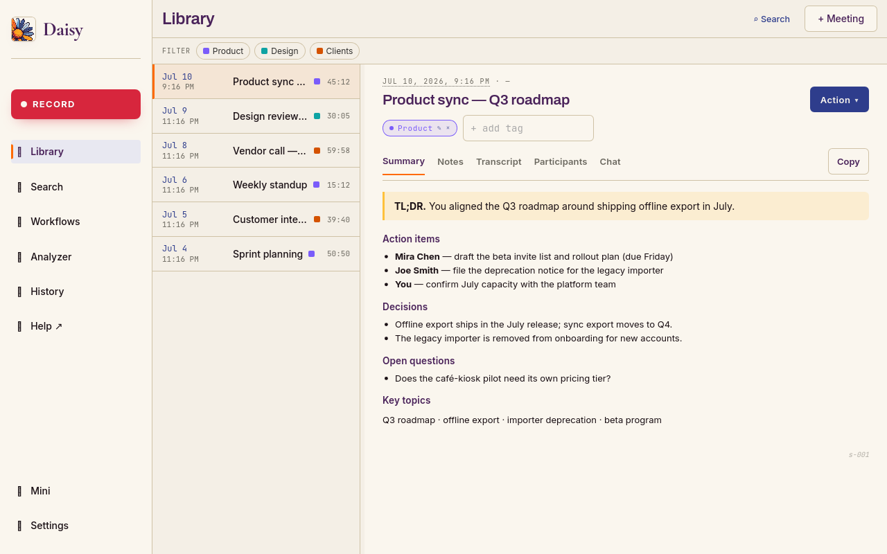
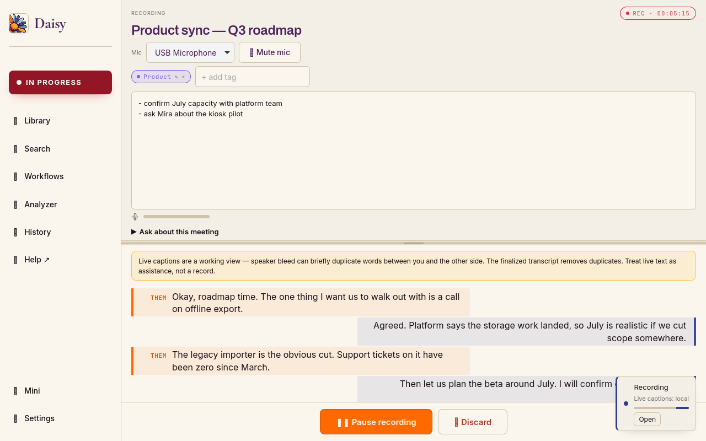
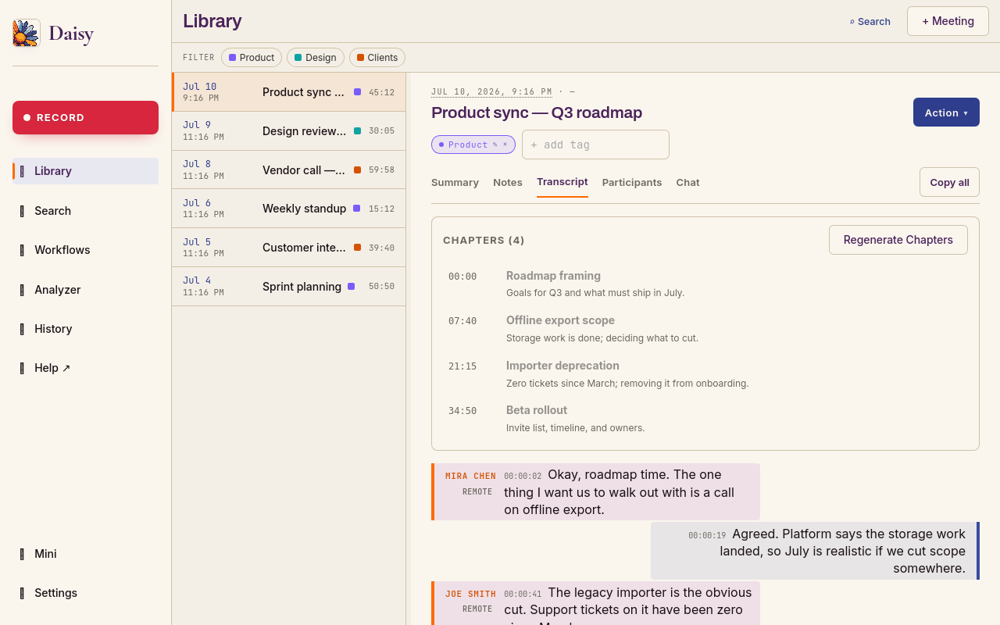
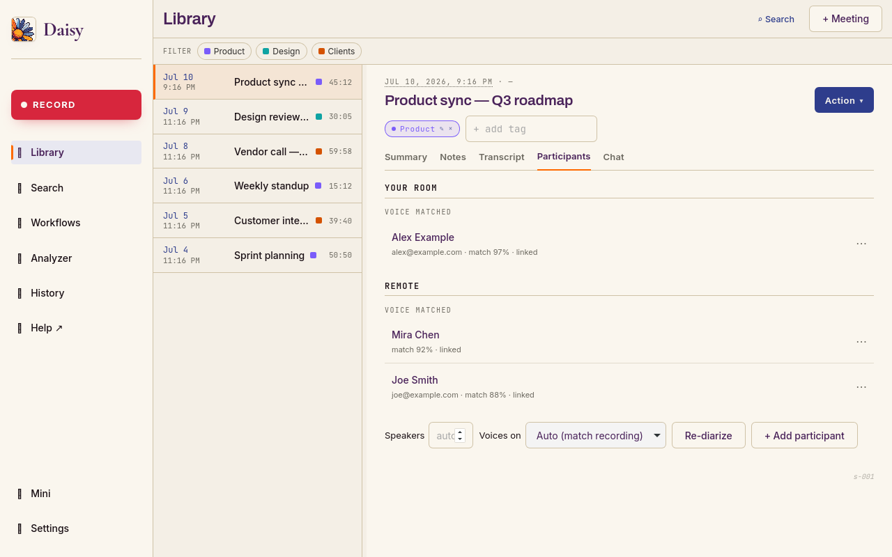
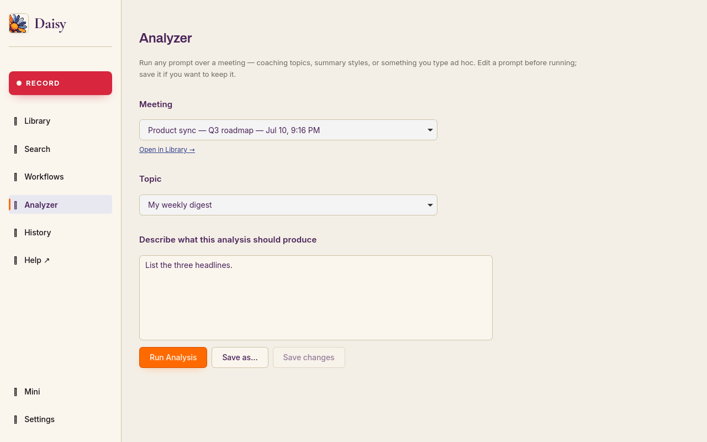
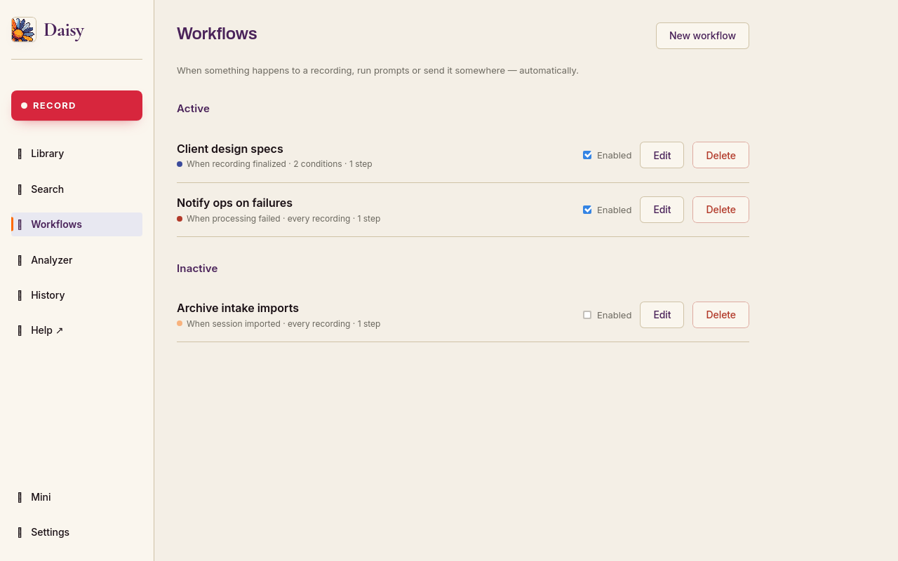
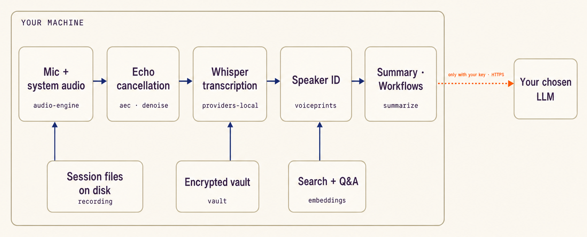

<div align="center">


**Your meetings, on your laptop, on your terms.**

A botless meeting recorder that transcribes, identifies speakers,
summarizes, and answers questions about your meetings — without sending
your audio to a vendor you didn't pick.

[](https://www.daisylocal.app)
[](LICENSE)
[](#privacy-by-data-type)
[](https://www.daisylocal.app/#download)



</div>

---

## Why Daisy

The usual meeting-AI deal: a bot joins your call, ships your audio to
someone else's cloud, charges per seat, and stores your transcripts on a
server you'll never see. Daisy turns that inside out:

- **Botless.** Records both sides through your laptop — Zoom, Meet,
  Teams, Discord, a phone call, a podcast. Nothing joins the call.
- **On-device by default.** Recording, transcription, speaker
  recognition, and search run on your machine. No account, no network
  required.
- **Knows who said what.** Speakers are identified on-device — never a
  cloud service — and a voice you label once is recognized in every
  future meeting.
- **Automates the follow-through.** Workflows run your prompts and push
  results to your own tools the moment a meeting finalizes.
- **Your disk, your folder.** Recordings, transcripts, summaries, and
  notes are plain files in a folder you choose — sync it, back it up,
  move it.
- **Bring your own brain.** Summaries, Q&A, and analysis run through
  *your* choice of LLM — Groq, OpenAI, Anthropic, or a fully local
  Ollama / LM Studio. Keys live in an encrypted vault on your machine.
- **Local-first, not local-only.** Everything works offline; the cloud
  is an option you reach for, never a default you opt out of.

---

## What you get

**🎙️ Record any conversation, no bot.** Both sides on separate
channels — your mic and everything coming out of your speakers — with
acoustic echo cancellation keeping "who said what" clean. Crash-safe
chunking on disk; discard mid-session if you don't want to keep it.

<div align="center"></div>

**✍️ Live captions, fast finalize.** Watch the transcript build as
people talk. When you stop, Daisy promotes the live transcript instead
of re-transcribing, cleans the audio, strips the "yeah–mm-hmm" filler,
and hands you a readable, timestamped transcript. Click any line to
jump to that moment in the recording.

<div align="center"></div>

**🗣️ Speakers identified on-device — always.** Diarization never uses
a cloud service, no matter which transcription path you pick. Label a
voice once and Daisy stores an encrypted voiceprint that recognizes
that person in future meetings automatically. Voiceprints are biometric
data: they live in the encrypted vault and you can delete them any time.

<div align="center"></div>

**🧠 Summaries that know who *you* are.** TL;DR, action items with
owners and due dates, decisions, open questions, key topics — framed in
the first person (*"you committed to send the contract by Friday"*).
Edit by hand, regenerate in a different style, or push to your own
Slack / Discord / webhook.

**💬 Ask your meeting history.** End a search with `?` — *"what did we
decide about project X?"* — and Daisy answers with dated citations that
jump straight to the cited moment: transcript scrolled to the line,
player cued to the timestamp. The reading happens on your machine; only
the final synthesis goes to your chosen LLM, which can be local too.

**🔎 Search everything at once.** Titles, transcripts, summaries,
notes, attendees, and tags in one query, with the matched phrase
highlighted and one click into the source.

**🎯 Analyze any meeting, any way.** Run any prompt over any
transcript — built-in analysis styles (PM / consultant / team-lead
voice) or prompts you write. Results are saved with the session.

<div align="center"></div>

**⚙️ Automate the follow-through.** Workflows fire on events — *"when a
recording tagged Client A finalizes, run the design-spec prompt and
send the result to my webhook."* Composable conditions (tags,
participants, title), ordered actions, live progress, full run history.

<div align="center"></div>

**📅 Calendar-aware.** Subscribe any ICS/iCal URL; one click starts a
recording pre-filled with the meeting's title, attendees, and tag.

**📥 Import anything.** MP3 / M4A / WAV / FLAC / OGG — a phone voice
memo gets the same transcription, diarization, and summary as a native
recording. Decode-only; your files are never re-encoded.

**🏷️ Tags with their own brains.** Per-tag summarization styles
("always pull next steps for the steering committee") applied
automatically, plus library and search filtering.

**🔐 An encrypted vault with no back door.** API keys and voiceprints
under Argon2id + AES-256-GCM. The passphrase never leaves your laptop
and there is no reset — your keys are genuinely yours.

**🎟️ A license you own.** 30-day free trial, no account. One license,
**3 devices**, seats you can move between machines. Verification is a
signed token checked offline — Daisy never phones home to keep running.

---

## What you bring

Every row works with the lightest setup that unlocks it — nothing below
requires an account with us.

| Feature | On-device only | + local LLM (Ollama / LM Studio) | + BYOK cloud LLM |
|---|:--:|:--:|:--:|
| Botless recording (both channels, AEC) | ✅ | ✅ | ✅ |
| Transcription (bundled Whisper, ~142 MB) | ✅ | ✅ | ✅ |
| Speaker recognition + voiceprints | ✅ | ✅ | ✅ |
| Live captions | ✅¹ | ✅¹ | ✅¹ |
| Workflows / integrations² | ✅ | ✅ | ✅ |
| Import audio files | ✅ | ✅ | ✅ |
| Search across all meetings | ✅ | ✅ | ✅ |
| Calendar, tags, tag prompts | ✅ | ✅ | ✅ |
| Encrypted vault | ✅ | ✅ | ✅ |
| Summaries, chapters | — | ✅ | ✅ |
| Ask-your-history Q&A | — | ✅ | ✅ |
| Analyzer | — | ✅ | ✅ |

¹ Live captions always run on-device. A per-machine speed check decides
whether they appear while you record; machines that skip them still get
the full transcript at finalize. Override any time in Settings.

² Workflows run locally; what you push to an integration goes to an
endpoint you configured — off-device by definition, and under your
purview.

No LLM at all? Daisy hands you the transcript with a ready-made prompt
to paste anywhere. You never hit a wall.

---

## Privacy by data type

| Data | Where it lives | Leaves your machine? |
|---|---|---|
| Raw audio | `.wav` chunks + compact `meeting.opus` archive, your folder | **Never** — transcription is on-device, always |
| Transcripts | Markdown, your folder | Only if you press "Send to…" or pick a cloud LLM for summaries |
| Speaker voiceprints | Encrypted vault (Argon2id → AES-256-GCM) | **Never** — deletable any time |
| API keys | Same vault | **Never** |
| Summaries / Q&A | Your folder | Only the *text* goes to the LLM **you** chose, with **your** key — or stays local with Ollama / LM Studio |
| License | Signed token on disk | **Never** — verified offline |

Private by default, your choice to extend: the one step that can leave
your machine (LLM synthesis) is one you configure yourself, and even
that can stay local. Daisy never proxies your data through our servers.

---

## Platforms

| Platform | Download | Live captions |
|---|---|---|
| **Linux** (x86_64, Ubuntu 24.04+ baseline) | [AppImage](https://www.daisylocal.app/thanks?os=linux) | On-device on capable hardware |
| **Windows** (x86_64) | [NSIS installer](https://www.daisylocal.app/thanks?os=win) · [portable `.zip`](https://www.daisylocal.app/thanks?os=win-portable) | On-device on capable hardware |
| **macOS** (Apple Silicon) | [Signed, notarized `.dmg`](https://www.daisylocal.app/thanks?os=mac) | **On-device via Metal** |

Download at **[daisylocal.app](https://www.daisylocal.app)** — signed
builds, 30-day free trial, no account. First-run setup is under a
minute: accept the terms, pick a folder and a mic, set a vault
passphrase (or trust the machine), optionally add an AI provider. The
Whisper models ship inside the build — the first recording works with
no downloads and no keys.

---

## How it's built

The entire pipeline runs inside your machine; each claim above maps to
a crate you can read:

<div align="center"></div>

The one dotted line is the whole cloud story: transcript text to the
LLM **you** configured, with **your** key — or nothing at all with a
local model. Audio never crosses it. `grep` the tree for `reqwest` and
check every call site — or read the full
**[security & threat model](docs/SECURITY.md)**: data inventory,
encryption at rest, the complete network-egress table, and what we
deliberately leave out of scope.

## Read the source, pay for the build

This repository is **source-visible**: published so you can verify the
core promise — audio never leaves your machine — by reading the code,
not by trusting us. It is not an open-source project: issues are
welcome, pull requests are not (see [CONTRIBUTING.md](CONTRIBUTING.md)).

Build it yourself — full instructions in
[`docs/BUILDING.md`](docs/BUILDING.md):

```bash
bash scripts/setup-dev.sh                 # apt deps + rustup + node + pnpm
bash scripts/download-whisper.sh          # bundled Whisper model
bash scripts/download-embeddings.sh       # Q&A embedding model
bash scripts/download-voiceprints.sh      # speaker-recognition models

pnpm --dir apps/frontend install --frozen-lockfile
pnpm --dir apps/frontend build
cargo build --release -p tauri-app --features custom-protocol
./target/release/daisy-app
```

The paid product is the official build: signed, notarized,
auto-updating, licensed — at
[daisylocal.app](https://www.daisylocal.app). Self-builds are free for
personal, non-commercial use — see the license.

---

## License

Daisy is **source-visible software under the
[Elastic License 2.0](LICENSE)** with an additional permission: read
it, modify it, build it yourself — and for **personal, non-commercial
use** run your own build without a license, even with the license gate
disabled. Commercial use requires a
[paid license](https://www.daisylocal.app); providing Daisy to others
as a product or service, or distributing builds with the license gate
removed, is not permitted. The Daisy name and logo are trademarks —
see [TRADEMARK.md](TRADEMARK.md). Bundled open-source components keep
their original licenses; the full attribution list is in the app under
Settings → About → Open-source licenses.

---

## Credits & acknowledgements

Daisy stands on excellent open work:

- [Tauri](https://github.com/tauri-apps/tauri) — the application shell
- [whisper.cpp](https://github.com/ggerganov/whisper.cpp) via
  [whisper-rs](https://codeberg.org/tazz4843/whisper-rs) — on-device transcription
- [DTLN-aec](https://github.com/breizhn/DTLN-aec) (Westhausen et al.) — acoustic echo cancellation
- [speakrs](https://github.com/avencera/speakrs) with the
  [pyannote](https://github.com/pyannote/pyannote-audio) community models and
  [WeSpeaker](https://github.com/wenet-e2e/wespeaker) embeddings — speaker diarization
- [BGE-small](https://huggingface.co/BAAI/bge-small-en-v1.5) — search & Q&A embeddings
- [ONNX Runtime](https://github.com/microsoft/onnxruntime) via
  [ort](https://github.com/pykeio/ort) — model inference
- [Opus](https://opus-codec.org/) — audio compression

The complete attribution list, with each component's license text, ships
in the app under Settings → About → Open-source licenses.

---

## Why Daisy exists

Daisy was originally built to help our hard-of-hearing child take better
notes in first year — and it kind of took off from there. Something that
used to be genuinely hard suddenly became achievable, as with many
things AI. Privacy mattered as much as making it work well —
and the final transcripts are great. But mostly, Daisy is out here to
help people.

### About us

Small Bricktory is the culmination of a decades-long journey of
self-discovery in technology as a craft and a hobby. Technology is our
paintbrush, our clay — and in the final analysis, anything created must
be freely available for anyone to enjoy. That is why we exist.

---

<div align="center">
<sub>Local-first · Linux + Windows + macOS · Built for people who want their meetings to stay theirs.</sub>
</div>
